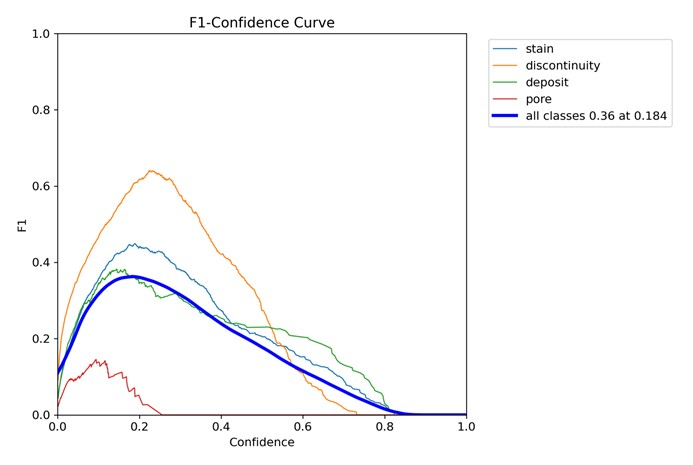

# WeldSight: Comprehensive Technical Summary

## 1. Executive Summary

The **WeldSight** project successfully implemented and evaluated an advanced object detection system based on the **YOLOv11s** architecture for real-time quality control of industrial welds. The system utilized the high-fidelity, industrially specialized **LoHi-WELD** dataset, targeting four critical defect classes: **Pores, Deposits, Discontinuities, and Stains**.

The core methodology employed a robust **Stratified 5-Fold Cross-Validation** protocol, ensuring rigorous evaluation against data imbalance risks. While the model demonstrated reasonable detection capability ($\mathbf{\text{mAP}@50 = 0.434}$), a critical failure in geometric precision was identified. The $\mathbf{\text{mAP}@50:95}$ score collapsed to **$0.181$**, resulting in a devastating **$25.3$ percentage point localization gap**.

This deficit signals a **Localization Bottleneck** and a **Confidence Crisis**, confirming that the current YOLOv11s architecture lacks the sufficient capacity to meet the stringent geometric fidelity ($\text{IoU} \ge 75\%$) required for automated industrial repair and guidance systems. A clear remediation roadmap focusing on architectural upgrade (YOLOv11m) and loss re-weighting is proposed to achieve deployment readiness.

## 2. Methodology and Training Protocol

| Parameter | Value | Rationale/Source |
| :--- | :--- | :--- |
| **Architecture** | YOLOv11s (Ultralytics) | Lightweight model selected for initial real-time feasibility. |
| **Dataset** | **LoHi-WELD** | Industrial dataset featuring 4 defect classes (Pores, Deposits, Discontinuities, Stains). |
| **Input Resolution** | $\mathbf{800 \times 800}$ pixels | Elevated resolution chosen specifically to retain features of small defects (e.g., Pores). |
| **Validation** | **Stratified 5-Fold CV** | Statistical framework to mitigate bias and evaluate generalization against class imbalance. |
| **Epochs** | 130 per fold | Sufficient training cycles using the AdamW optimizer. |
| **Optimizer** | **AdamW** | Standard choice for deep learning vision tasks. |
| **Learning Rate Schedule** | Cosine Annealing | Used by the Ultralytics framework for stable convergence. |

## 3. Detailed Quantitative Results

The final performance was assessed using the results from the Best Model (selected based on the highest $\text{mAP}@50:95$ among the 5 folds).

### Performance Metrics

| Metric | Score | Industrial Interpretation |
| :--- | :--- | :--- |
| **$\mathbf{\text{mAP}@50}$** | $\mathbf{0.434}$ | **Adequate:** $\text{IoU} \ge 50\%$ detection rate is acceptable for rough defect identification. |
| **$\mathbf{\text{mAP}@50:95}$** | $\mathbf{0.181}$ | **Critical Failure:** Fails the high geometric accuracy requirement for safety-critical deployment. |
| **Localization Gap** | **$25.3$ points** | Proves model's inability to precisely regress bounding box coordinates. |

### $\mathbf{F_1}$ Score and Confidence Analysis

Analysis of the $\text{F}_1$ Score curve (shown below) revealed an optimal detection threshold of approximately $\mathbf{0.25}$. This low threshold is further evidence of the model's **Confidence Crisis**, as a robust model typically achieves peak $\text{F}_1$ score near a confidence threshold of $0.5$.

## 4. Visualizations (From `runs/` Directory)

All key visualization plots generated by the Ultralytics framework, essential for diagnostic analysis, are listed here.

| Visualization | Purpose | Placeholder Image |
| :--- | :--- | :--- |
| **Confusion Matrix** (`confusion_matrix.png`) | Diagnoses misclassification rates between classes. Crucial for identifying false negative rates for rare classes (Pores/Discontinuities). |  |
| **Precision-Recall Curve** (`BoxPR_curve.png`) | Shows the trade-off between precision and recall across all thresholds. |  |
| **$\mathbf{F_1}$ Score Curve** (`BoxF1_curve.png`) | Identifies the optimal confidence threshold and confirms the low confidence stability. |  |
| **Sample Detections** (`val_batchX_pred.jpg`) | Qualitative assessment of the model's bounding box placement on validation images. |  |

## 5. Future Development and Remediation Roadmap

To break the localization bottleneck and achieve the stringent $\mathbf{\text{mAP}@50:95}$ necessary for reliable deployment, the following actions are recommended:

1. **Architectural Upgrade:** Migrate from the lightweight **YOLOv11s** to the higher-capacity **YOLOv11m** network. This provides the necessary parameter count and complexity to handle the intricate boundary prediction of weld defects.

2. **Loss Function Re-Weighting (Hyperparameter Tuning):** Modify the training configuration to **increase the penalty weight assigned to the Bounding Box Regression Loss** (e.g., CIoU or DIoU loss) relative to the classification loss. This deliberate re-weighting forces the optimizer to prioritize minimizing the geometric error ($\text{IoU}$ distance) over simple classification.

3. **Targeted Data Augmentation for Boundary Refinement:** Enhance the augmentation strategy with stronger geometric transformations, such as controlled **rotation** and minor **shear** operations. This forces the model to learn a more robust, generalized representation of defect edges, supporting stable $\text{mAP}@50:95$ output under minor visual variations.
